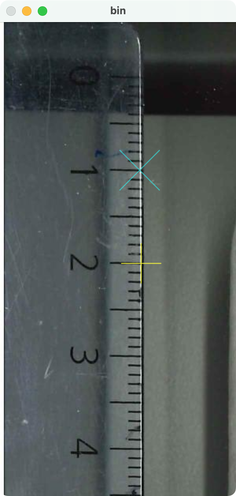

# visualRootMeasurement

This tool aims to automize the lenght measurement of plant roots on images.It is based on OpenCV 4.

> [!WARNING]
> The results of the current implementation need more validation. Do not trust the current results!

## Build

**Requirements:** OpenCV needs to be installed (<https://opencv.org/releases/>).

Run `make` in the terminal in this directory.

## Usage

call this program with a path to an image (e.g. JPG, TIFF, PNG) to analyze as command line argument.

```bash
./rootDetection path/to/img.jpg
```

It will open a window to pick a reference length of ten millimeters. One moves the reference points via the cursor keys and accepts the first as well as the second reference marker with '*Enter*'.

<p align="center">

</p>

Then, the image is opened twice. The black and white image shows the threshold, used for the current measurement and the collored image shows the input image with overlays for the detected roots, together with their estimated lenght.

For better readability, the colors of the overlays can be changed from monochromatic green to a palette of different colors fith the key '*c*'


## Key Functions

The application can be controlled via the keyboard.

### Calibration Mode

|Key|Function|
|---|--------|
| ↑/↓/←/→ |Move reference marker arround|
| ↵ |Set marker|

### Measurement Mode

|Key|Function|
|---|--------|
| ↑ |Decrease threshhold by ten|
| ↓ |Increase threshhold by ten|
| ← |Decrease threshhold by one|
| → |Increase threshhold by one|
| + |Zoom in|
| - |Zoom out|
|w/a/s/d |Move around in zoomed view|
| c |Switch color mode|
|ESC/↵|Quit application|
